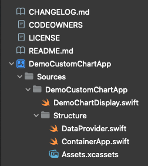
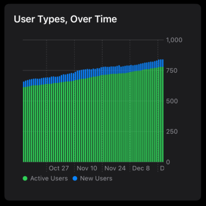
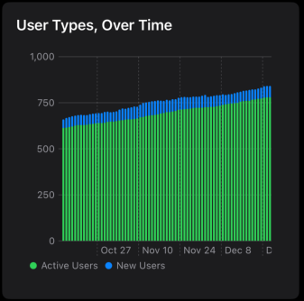

# Demonstration Custom [SwiftUI Chart](https://developer.apple.com/documentation/Charts/Chart)

This project demonstrates simple customizing of [SwiftUI Charts](https://developer.apple.com/documentation/Charts/Chart), by modifying the display, and adding "scrub to select," and "pinch to zoom" functionality.

The idea is to understand how the charts work, and places that we can customize them. The examples will be fairly simple, but every one of these adornments we'll be looking at, will allow a lot more than what we'll be covering, here.

## Chart Data

The chart will display dummy data, from an application that has user accounts. The chart will represent the number of users signed up for the app, with a differentiation between "active" users (users that have signed in, at least once), and "new" users (users that have accounts, but have never signed in). The data is a list of totals, at the end of each day, for 71 days successive.

## Project Structure

The project is set up as a very simple, 1-view SwiftUI app.

We should access the project, by opening [the workspace (`DemoCustomChartApp.xcworkspace`)](https://github.com/LittleGreenViper/DemoCustomChartApp/tree/master/DemoCustomChartApp.xcworkspace) file.

If we do that, the project navigator panel (left side) will look like this (in the [`00.Starting-Point`](https://github.com/LittleGreenViper/DemoCustomChartApp/tree/00.Starting-Point) tag):

| Figure 0: Initial Xcode Navigator Display |
| :-: |
|  |

### Support Code

Much of the code is in a subdirectory, labeled [`Sources/DemoCustomChartApp/Structure`](https://github.com/LittleGreenViper/DemoCustomChartApp/tree/master/Sources/DemoCustomChartApp/Structure). This has the files that we won't be looking at.

They consist of:

- [`Sources/DemoCustomChartApp/Structure/ChartData.swift`](https://github.com/LittleGreenViper/DemoCustomChartApp/tree/master/Sources/DemoCustomChartApp/Structure/ChartData.swift)
    This is the data provider for the chart data. It is a simple struct that converts some CSV data into a form that can be easily fed to the chart (plottable data).
    
- [`Sources/DemoCustomChartApp/Structure/ContainerApp.swift`](https://github.com/LittleGreenViper/DemoCustomChartApp/tree/master/Sources/DemoCustomChartApp/Structure/ContainerApp.swift)
    This is the actual app and main screen wrapper.
    
- [`Sources/DemoCustomChartApp/Structure/Assets.xcassets`](https://github.com/LittleGreenViper/DemoCustomChartApp/tree/master/Sources/DemoCustomChartApp/Structure/Assets.xcassets)
    This has the graphic assets, such as the accent color and app icon.
    
### Demonstration Code

The code that we will be working with, is in the main project directory, and is called [`Sources/DemoCustomChartApp/DemoChartDisplay.swift`](https://github.com/LittleGreenViper/DemoCustomChartApp/tree/master/Sources/DemoCustomChartApp/DemoChartDisplay.swift).

## Tags

### [00.Starting-Point](https://github.com/LittleGreenViper/DemoCustomChartApp/releases/tag/00.Starting-Point)

At this point, we have not done any customization. The table is completely default. We have an app that will compile, run, and display a chart, like that, shown in Figure 1:

| Figure 1: Initial Chart Display |
| :-: |
|  |

The code in the [`DemoChartDisplay.swift`](https://github.com/LittleGreenViper/DemoCustomChartApp/blob/00.Starting-Point/Sources/DemoCustomChartApp/DemoChartDisplay.swift) file, will look like this (comments removed, in order to reduce the code listing size):

#### Listing 1. Basic Bar Chart Display

```swift
import SwiftUI
import Charts

struct DemoChartDisplay: View {
    @State var data = DataProvider()

    var body: some View {
        Chart(data.rows) { inRow in
            ForEach(inRow.userTypes) { inUserType in
                BarMark(
                    x: .value("Date", inRow.sampleDate, unit: .day),
                    y: .value(inUserType.description, inUserType.value)
                )
                .foregroundStyle(inUserType.color)
            }
        }
        .chartForegroundStyleScale(
            [
                data.legend[0].description: data.legend[0].color,
                data.legend[1].description: data.legend[1].color
            ]
        )
    }
}
```

This is the most basic bar chart that you can have, with a "legend" at the bottom (that [`chartForegroundStyleScale`](https://developer.apple.com/documentation/swiftui/view/chartforegroundstylescale\(_:\)) adornment, which displays the dots, followed by the names of the user types).

Note that each bar has two colors, with the green color representing the number of "active" users, and the blue color representing the number of "new" users.

The X-axis and Y-axis positions and labels are default.

### [01.YAxis-Position](https://github.com/LittleGreenViper/DemoCustomChartApp/releases/tag/01.YAxis-Position)

The next thing that we'll do, is move the Y-axis labels and ticks, to the left of the chart, as opposed to the right (default).

| Figure 2: Y-Axis Labels on Left |
| :-: |
|  |

We do this by adding a [`chartYAxis`](https://developer.apple.com/documentation/swiftui/view/chartyaxis\(content:\)) adornment to the chart.

This has an [`AxisContentBuilder`](https://developer.apple.com/documentation/Charts/AxisContentBuilder) closure that we'll use to add the specific customizations we'll need.

Inside of that, we will add an [`AxisMarks`](https://developer.apple.com/documentation/charts/axismarks) struct, using [the ContentBuilder variant of the initializer](https://developer.apple.com/documentation/charts/axismarks/init(preset:position:values:content:\)\-1n9x7)). We also tell it to be [aligned](https://developer.apple.com/documentation/charts/axismarkpreset/aligned) to the [leading](https://developer.apple.com/documentation/charts/axismarkposition/leading) edge of the chart.

This will iterate through all the values the chart wants to display (at present, we are letting SwiftUI figure out how many values to show).

The argument that is passed into the content builder closure, is an instance of [`AxisValue`](https://developer.apple.com/documentation/charts/axisvalue/), which has the axis element value and position. We'll ignore it, for now.

What adding the [`chartYAxis`](https://developer.apple.com/documentation/swiftui/view/chartyaxis\(content:\)) adornment does, is completely replace the trailing-side default Y-axis display, so we'll need to take care of adding all the Y-axis visual elements, which are the value text (a label), a tick (a small line that extends between the edge of the chart and the value label), and the axis line (the one that goes horizontally across the chart, at the value level).

For now, we'll be sticking with the default values for most of these, but we will have to specify a couple of things.

First, the tick. We'll add an [`AxisTick`](https://developer.apple.com/documentation/charts/axistick) struct. We won't specify a length or stroke style, so it will be a short, solid line.

Next, the [`AxisGridLine`](https://developer.apple.com/documentation/charts/axisgridline) that will extend across the chart. We'll stick with the default, which is just a thin, solid horizontal line.

Finally, the [`AxisValueLabel`](https://developer.apple.com/documentation/charts/axisvaluelabel). This is the actual displayed value. We specify that the attachment to the chart (the `anchor` parameter), is on the [trailing](https://developer.apple.com/documentation/swiftui/unitpoint/trailing) edge (default is [leading](https://developer.apple.com/documentation/swiftui/unitpoint/leading)).

The code in the [`DemoChartDisplay.swift`](https://github.com/LittleGreenViper/DemoCustomChartApp/blob/01.YAxis-Position/Sources/DemoCustomChartApp/DemoChartDisplay.swift) file, will now look like this (comments removed, in order to reduce the code listing size):

#### Listing 2. With Y-Axis Adornment

```swift
import SwiftUI
import Charts

struct DemoChartDisplay: View {
    @State var data = DataProvider()

    var body: some View {
        Chart(data.rows) { inRow in
            ForEach(inRow.userTypes) { inUserType in
                BarMark(
                    x: .value("Date", inRow.sampleDate, unit: .day),
                    y: .value(inUserType.description, inUserType.value)
                )
                .foregroundStyle(inUserType.color)
            }
        }
        .chartForegroundStyleScale(
            [
                data.legend[0].description: data.legend[0].color,
                data.legend[1].description: data.legend[1].color
            ]
        )
        .chartYAxis {
            AxisMarks(preset: .aligned, position: .leading) { _ in
                AxisTick()
                AxisGridLine()
                AxisValueLabel(anchor: .trailing)
            }
        }
    }
}
```
